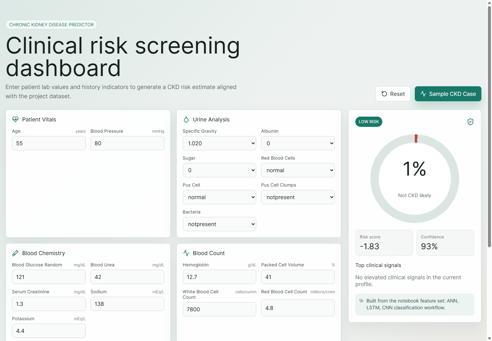
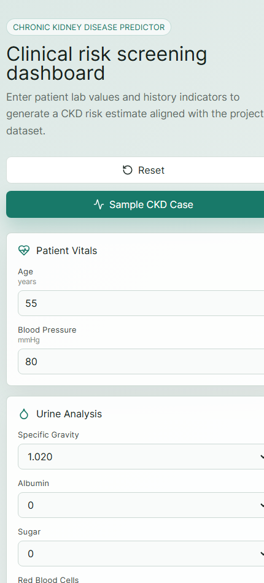

# Kidney Disease Prediction

A React-based clinical screening dashboard for chronic kidney disease risk prediction. The project is based on the `kidney_disease.csv` dataset and the included notebook workflow that explores ANN, LSTM, and CNN classification models.

The current app is frontend-only and runs a local JavaScript risk scoring engine, so it can be deployed as a static website without a backend or saved ML model.

## System Screenshots

### Desktop Dashboard



### Mobile Dashboard



## Features

- Professional React UI for CKD screening
- Patient vitals, urine analysis, blood chemistry, blood count, and clinical history inputs
- Real-time risk estimate with risk band, confidence, and top clinical signals
- Sample CKD case button for quick demo
- Responsive desktop and mobile layout
- Frontend-only prediction logic in `src/predictionEngine.js`

## Tech Stack

- React
- Vite
- JavaScript
- CSS
- Lucide React icons

## Project Structure

```text
.
├── Kidney (4).ipynb
├── kidney_disease.csv
├── index.html
├── package.json
├── src/
│   ├── App.jsx
│   ├── main.jsx
│   ├── predictionEngine.js
│   └── styles.css
└── screenshots/
    ├── desktop-dashboard.png
    └── mobile-dashboard.png
```

## Run Locally

Install dependencies:

```bash
npm install
```

Start the development server:

```bash
npm run dev
```

Open:

```text
http://localhost:5173/
```

## Build For Production

```bash
npm run build
```

The production files are generated in:

```text
dist/
```

## Deployment

Because the current version is frontend-only, it can be deployed directly to static hosting platforms such as:

- Vercel
- Netlify
- GitHub Pages
- Firebase Hosting

Recommended Vercel settings:

```text
Framework: Vite
Build command: npm run build
Output directory: dist
```

## Model Note

The notebook includes deep learning experiments using:

- Artificial Neural Network
- Long Short-Term Memory
- Convolutional Neural Network

Those trained models are not currently exported as backend services. To use a real trained model in production, export the trained model and preprocessing pipeline, then connect the React app to a Python API such as FastAPI or Flask.

## Disclaimer

This application is for educational and demonstration purposes only. It should not be used as a medical diagnosis tool.
